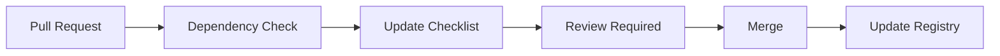

<!---
FILE: DOC_DEP_IMPLEMENTATION_ROADMAP.md
PURPOSE: Phased implementation plan for documentation dependency system
VERSION: v1.0
STATUS: Active
DEPENDS_ON: DOC_DEP_SIMPLIFIED.md, documentation_dependencies.yaml
NEEDED_BY: DOC_CLAUDE, repository maintainers
MOVES_WITH: /docs/repository/dependency_maps/
LAST_UPDATE: 2025-10-31 [DOCUMENTATION-2025-10-31-11]
--->

# DOC_DEP Implementation Roadmap

**Timeline:** November 2025 - January 2026  
**Owner:** DOC_CLAUDE (Documentation Orchestration Claude)  
**Goal:** Systematic documentation dependency tracking  
**Method:** Phased rollout with continuous value delivery  

────────────────────────────────────────────────────

## 📅 **PHASE TIMELINE**

```
Nov 2025    Dec 2025    Jan 2026
│           │           │
├─ Phase 1 ─┼─ Phase 2 ─┼─ Phase 3 ─┤
│           │           │           │
Pilot       Expand      Automate    Integrate
(5 files)   (20 files)  (Scripts)   (CI/CD)
```

---

## 🎯 **PHASE 1: PILOT (Week 1 - Nov 1-7, 2025)**

### Objectives
- Prove the concept works
- Identify refinements needed
- Deliver immediate value
- Build momentum

### Deliverables

#### Week 1 Sprint
**Day 1-2 (Nov 1-2):**
- [x] Create simplified DOC_DEP documentation
- [x] Create documentation_dependencies.yaml
- [ ] Tag README.md with deps comments
- [ ] Tag MISSION_CURRENT.md
- [ ] Create REPO_LOG entry

**Day 3-4 (Nov 3-4):**
- [ ] Tag console.py preset sections
- [ ] Tag SUCCESS_CRITERIA.md validation
- [ ] Tag DEPLOYMENT.md setup sections
- [ ] Update YAML registry with findings

**Day 5-7 (Nov 5-7):**
- [ ] Test with simulated preset change
- [ ] Generate first manual checklist
- [ ] Document lessons learned
- [ ] Refine tagging format if needed

### Success Metrics
- ✅ 5 files fully tagged
- ✅ 3+ features mapped in registry
- ✅ 1 successful checklist generation
- ✅ <30 min to find all update locations

### Pilot Files Priority
1. **README.md** - Most referenced, highest value
2. **MISSION_CURRENT.md** - Changes frequently
3. **console.py** - Config source of truth
4. **SUCCESS_CRITERIA.md** - Validation critical
5. **DEPLOYMENT.md** - Setup instructions

---

## 📈 **PHASE 2: EXPAND (Weeks 2-4 - Nov 8-30, 2025)**

### Objectives
- Scale to meaningful coverage
- Build registry comprehensively
- Create tooling foundation
- Train team on system

### Week 2 (Nov 8-14): Core Expansion
- [ ] Tag 5 additional high-traffic files
- [ ] Add 5 more features to registry
- [ ] Create Python checklist generator v1
- [ ] Document tagging best practices

**Target Files:**
- README_C.md (master state)
- VUDU_PROTOCOL.md (coordination)
- BOOTSTRAP_CLAUDE.md (identity)
- app.py (entry point)
- calculations.py (YPA logic)

### Week 3 (Nov 15-21): Tool Development
- [ ] Build deps tag validator script
- [ ] Create registry consistency checker
- [ ] Implement basic staleness detection
- [ ] Generate first coverage report

**Tools to Build:**
```python
# deps_validator.py - Check tag format
# registry_checker.py - Validate YAML
# staleness_detector.py - Find old docs
# coverage_reporter.py - Measure progress
```

### Week 4 (Nov 22-30): Process Integration
- [ ] Tag 10 more files (total: 20)
- [ ] Create team training materials
- [ ] Run first monthly audit
- [ ] Plan Phase 3 automation

### Success Metrics
- ✅ 20 files tagged (25% coverage)
- ✅ 10+ features in registry
- ✅ Tooling operational
- ✅ Team trained on system
- ✅ 50% reduction in update time

---

## 🚀 **PHASE 3: AUTOMATE (Dec 2025)**

### Objectives
- Automate repetitive tasks
- Integrate with development flow
- Achieve meaningful coverage
- Measure improvement

### Week 5-6 (Dec 1-14): Automation Sprint
- [ ] Create auto-tagging assistant
- [ ] Build checklist generator v2
- [ ] Implement PR comment bot
- [ ] Deploy validation webhook

### Week 7-8 (Dec 15-31): Coverage Push
- [ ] Reach 40 files tagged (50% coverage)
- [ ] Map all critical features
- [ ] Create dependency visualizer
- [ ] Generate year-end report

### Automation Targets
```yaml
automated_tasks:
  tagging:
    - Suggest tags for new files
    - Validate existing tags
    - Flag missing dependencies
  
  checklists:
    - Auto-generate on PR open
    - Post as PR comment
    - Track completion status
  
  validation:
    - Check registry accuracy
    - Detect stale documentation
    - Alert on missing updates
```

### Success Metrics
- ✅ 50% repository coverage
- ✅ <10 min update identification
- ✅ 75% reduction in stale docs
- ✅ Automation saves 5+ hours/week

---

## 🔄 **PHASE 4: INTEGRATE (Jan 2026)**

### Objectives
- Full CI/CD integration
- Self-maintaining system
- Complete coverage
- Continuous improvement

### Integration Points


### Target State
- **Coverage:** 80% of repository
- **Automation:** 90% of tasks
- **Update Time:** <5 minutes
- **Staleness:** <2% of docs
- **Manual Work:** Registry maintenance only

---

## 📊 **SUCCESS TRACKING**

### Weekly Metrics Dashboard
```
Week    Files Tagged    Features Mapped    Time Saved
────────────────────────────────────────────────────
1       5 (6%)         3                  30 min
2       10 (12%)       8                  2 hrs
3       15 (19%)       12                 4 hrs
4       20 (25%)       15                 6 hrs
8       40 (50%)       25                 15 hrs
12      65 (80%)       35                 25 hrs
```

### Monthly Checkpoints
- **November:** Pilot success, 25% coverage
- **December:** Automation online, 50% coverage
- **January:** CI/CD integrated, 80% coverage

---

## ⚠️ **RISK MITIGATION**

### Risk: Adoption Resistance
**Mitigation:** Start with volunteers, show value early, make it easy

### Risk: Over-Engineering
**Mitigation:** Stay simple, iterate based on actual use, avoid premature optimization

### Risk: Maintenance Burden
**Mitigation:** Automate early, distribute ownership, regular audits

### Risk: Incomplete Coverage
**Mitigation:** Focus on high-value files first, accept gradual adoption

---

## 💡 **QUICK WINS STRATEGY**

### Week 1 Quick Wins
1. **Tag README.md** → Instant value for most-used file
2. **Map presets** → Current mission relevance
3. **Generate checklist** → Prove concept works

### Month 1 Quick Wins
1. **Python scripts** → Reduce manual work
2. **Coverage report** → Show progress
3. **Time tracking** → Prove ROI

### Month 3 Quick Wins
1. **CI/CD hooks** → Automatic value
2. **Visualizations** → Impressive demos
3. **Case studies** → Success stories

---

## 📈 **GROWTH PROJECTIONS**

```
            Current     Month 1     Month 3     Month 6
            (Oct 31)    (Nov 30)    (Jan 31)    (Apr 30)
───────────────────────────────────────────────────────
Coverage    0%          25%         80%         95%
Automation  0%          20%         70%         90%
Time/Update 2-8 hrs     1-2 hrs     10-30 min   <5 min
Staleness   ~20%        ~10%        <5%         <2%
ROI         -           2x          10x         20x
```

---

## 🎬 **IMMEDIATE NEXT STEPS**

### Today (Oct 31)
1. ✅ Create roadmap (this document)
2. ✅ Build YAML registry
3. ✅ Document simplified system

### Tomorrow (Nov 1)
1. [ ] Tag first file (README.md)
2. [ ] Test deps comment format
3. [ ] Update REPO_LOG

### This Week (Nov 1-7)
1. [ ] Complete Phase 1 pilot
2. [ ] Generate first checklist
3. [ ] Measure time saved

---

## 🏆 **DEFINITION OF SUCCESS**

### Phase 1 Success (Nov 7)
"We can change presets and know exactly what docs to update"

### Phase 2 Success (Nov 30)
"The system saves us hours every week"

### Phase 3 Success (Dec 31)
"Documentation updates are largely automated"

### Phase 4 Success (Jan 31)
"The system maintains itself"

---

## 📝 **TRACKING & REPORTING**

### Weekly Status Format
```markdown
## DOC_DEP Week [N] Status

**Files Tagged:** X (Y%)
**Features Mapped:** Z
**Time Saved:** N hours
**Issues:** [Any blockers]
**Next Week:** [Priority tasks]
```

### Monthly Report Format
- Executive summary
- Metrics vs goals
- Success stories
- Lessons learned
- Next month plan

---

**"Start small. Deliver value. Scale systematically."** 🚀

**This is the DOC_CLAUDE way.** 🔥

────────────────────────────────────────────────────
**Roadmap Status:** Ready for execution  
**First Milestone:** November 7, 2025  
**Full Deployment:** January 31, 2026  
**ROI Target:** 20x time savings by Q2 2026
