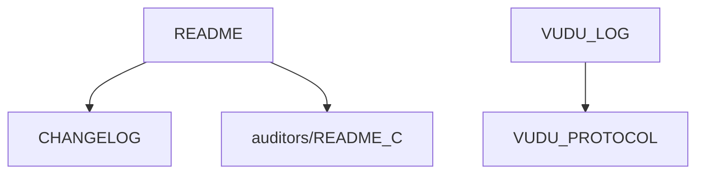

<!---
FILE: README.md
PURPOSE: Guide for dependency mapping and relationship tracking
VERSION: v1.0
STATUS: Active
DEPENDS_ON: Semantic headers in all files
NEEDED_BY: DOC_CLAUDE, validation processes, refactoring teams
MOVES_WITH: /docs/repository/dependency_maps/
LAST_UPDATE: 2025-10-31 [DOCUMENTATION-2025-10-31-4]
--->

<!-- deps: file_structure, documentation -->
# Dependency Maps

**Purpose:** Track and visualize file interdependencies across the repository  
**Method:** Extract from semantic headers (DEPENDS_ON/NEEDED_BY fields)  
**Current Map:** MASTER_DEPENDENCY_MAP.md  
**Last Updated:** 2025-10-31  
**Health Status:** ⚠️ PENDING INITIAL SCAN

## 🎯 Why Dependency Mapping?

**The Problem:** Hidden dependencies cause cascade failures during refactoring  
**The Solution:** Explicit dependency tracking via semantic headers  
**The Result:** Safe refactoring with known impact radius

This directory serves the PURPOSE of making all file relationships visible and validated.

## 🗺️ What Gets Mapped

### Core Dependencies
- **File-to-File:** Direct dependencies between documents
- **Directory-to-Directory:** Folder-level relationships
- **Cross-Domain:** Links between /auditors/, /docs/, root
- **External:** Dependencies on tools, APIs, services

### Dependency Types
```
DEPENDS_ON Types:
- Configuration files (protocols, standards)
- Data files (current state, logs)
- Process files (workflows, procedures)
- Identity files (bootstrap, role definitions)

NEEDED_BY Types:
- Downstream consumers
- Process workflows
- Validation systems
- User-facing features
```

## 📊 Map Components

### 1. **MASTER_DEPENDENCY_MAP.md**
The authoritative dependency map containing:
- ASCII tree visualization
- Dependency tables
- Circular dependency detection
- Orphan file identification
- Missing header list

### 2. **validation/** Folder
Validation logs showing:
- Map accuracy checks
- Broken dependency reports
- Header compliance stats
- Update recommendations

## 🔍 How to Generate Map

### Automatic Extraction (Preferred)
```python
# Pseudo-code for dependency extraction
1. Search all .md files for header blocks
2. Extract FILE, DEPENDS_ON, NEEDED_BY fields
3. Build bidirectional graph
4. Detect issues:
   - Circular: A→B→C→A
   - Orphan: No DEPENDS_ON or NEEDED_BY
   - Missing: Referenced but not found
5. Generate visualizations
6. Create tables and reports
```

### Manual Process (88MPH Speed)
```markdown
1. project_knowledge_search("DEPENDS_ON NEEDED_BY")
2. Extract all header blocks found
3. Build relationship list
4. Create ASCII tree diagram
5. Generate dependency tables
6. Identify issues
7. Save as MASTER_DEPENDENCY_MAP.md
```

## 📈 Dependency Health Metrics

### Current Statistics
```
Files with Headers: [TBD]% 
Documented Dependencies: [TBD]
Circular Dependencies: [TBD]
Orphan Files: [TBD]
Missing Dependencies: [TBD]
Cross-Domain Links: [TBD]
```

### Health Indicators
- 🟢 **HEALTHY:** >90% headers, 0 circular, <5% orphans
- 🟡 **WARNING:** 70-90% headers, 1-2 circular, 5-15% orphans
- 🔴 **CRITICAL:** <70% headers, >2 circular, >15% orphans

## 🎨 Visualization Formats

### ASCII Tree Format
```
README.md (root)
├── DEPENDS_ON: None
├── NEEDED_BY: All entry points
└── Connected to:
    ├── CHANGELOG.md
    ├── REPO_LOG.md
    └── auditors/
        └── README_C.md
```

### Table Format
```
| File | Depends On | Needed By | Status |
|------|------------|-----------|---------|
| README.md | None | All systems | ✅ |
| VUDU_LOG.md | VUDU_PROTOCOL.md | README_C.md | ✅ |
```

### Graph Format (Mermaid)


## 🚨 Common Issues Detected

### Circular Dependencies
**Problem:** A depends on B, B depends on C, C depends on A  
**Impact:** Cannot update any without breaking others  
**Solution:** Introduce intermediary or refactor relationships

### Orphan Files
**Problem:** Files with no dependencies or consumers  
**Impact:** Maintenance overhead, confusion  
**Solution:** Document purpose or remove

### Missing Headers
**Problem:** Files without semantic headers  
**Impact:** Dependencies unknown, mapping incomplete  
**Solution:** Add headers following HEADER_STANDARD.md

### Phantom Dependencies
**Problem:** DEPENDS_ON references non-existent files  
**Impact:** Broken expectations, failed operations  
**Solution:** Update headers or create missing files

## 📋 Validation Checklist

Before approving dependency map:
- [ ] All critical files have headers
- [ ] No unresolved circular dependencies
- [ ] Orphan files justified or removed
- [ ] Cross-references verified
- [ ] Bootstrap chain intact
- [ ] Mission dependencies clear

## 🔄 Update Triggers

**Generate new map when:**
- Major structural changes
- New directory added
- Bootstrap system modified
- Mission reorganization
- Monthly maintenance
- Before major refactoring

## 🎯 Success Criteria

**Dependency mapping succeeds when:**
- ✅ All relationships visible
- ✅ Safe refactoring possible
- ✅ Impact radius known
- ✅ No surprise breakages
- ✅ New contributors understand structure

## 🔗 Integration Points

**Uses:**
- Semantic headers from all files
- VUDU_HEADER_STANDARD.md specification

**Used by:**
- Refactoring processes
- Impact analysis
- Documentation validation
- Repository health reports

## 📝 Map Maintenance

**After Each Map Generation:**
1. Compare to previous map
2. Note significant changes
3. Validate new dependencies
4. Update health metrics
5. Archive old map if major changes
6. Update this README statistics

---
### Documentation Dependencies 🆕
Beyond file-to-file dependencies, we also track documentation-to-feature dependencies:
- **Analysis:** DOCUMENTATION_DEPENDENCY_ANALYSIS.md
- **Registry:** DOCUMENTATION_DEPENDENCIES.json (coming soon)
- **Purpose:** Know what documentation needs updating when features change
- **Status:** Pilot phase - tagging high-change files

**"To know the web is to navigate it safely."** 🕸️

**This is the way.** 🔥
